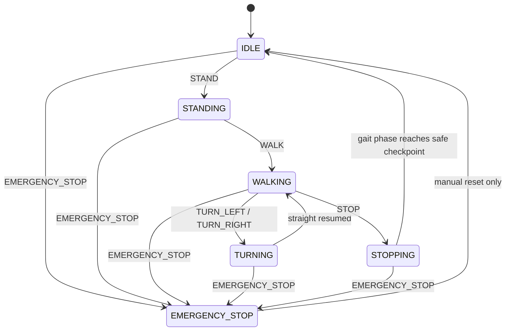
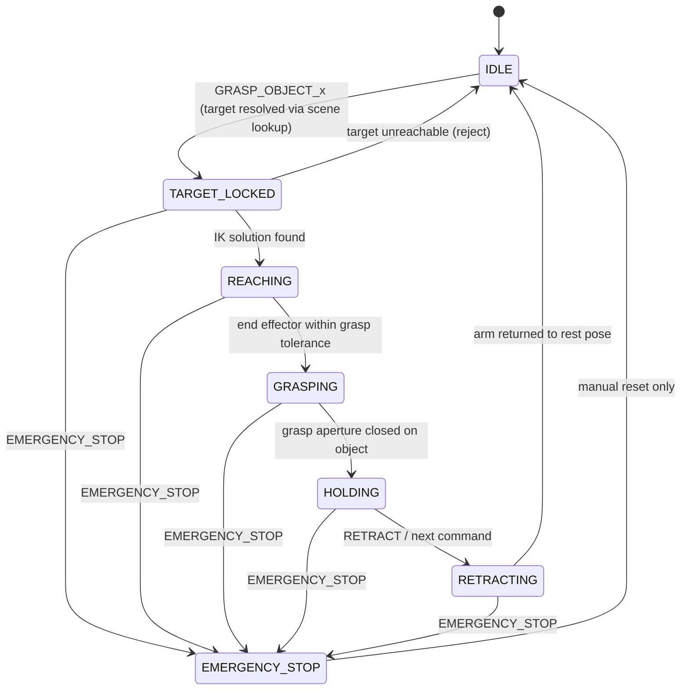
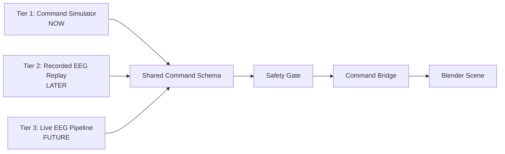

# SORDES Exoskeleton — Engineering Specification v1

2026-09-17 · @Someone

SORDES v1 (full exoskeleton + standalone prosthetic hand) is specified here as a kinematic-only engineering design: real joints, degrees of freedom, angle limits, actuator roles and control/safety logic — with no torque, mass, inertia, contact-force, or motor-dynamics modeling in this version.

## 1. Scope & Modeling Boundary

SORDES v1 is a **kinematic-only** simulation: joint angles and end-effector positions are commanded and reached exactly, on a scripted time profile. Nothing about force, mass, or physical dynamics is computed.

| Modeled in v1 (kinematic) | Explicitly NOT modeled in v1 |
| --- | --- |
| Joint positions, DOF, angle limits | Torque / force at any joint or actuator |
| Segment lengths & adjustable sizing | Mass, inertia, center of gravity |
| Forward & inverse kinematics (reach, gait) | Contact forces (foot-ground, hand-object grip force) |
| Time-parametrized trajectories (ease-in/out) | Motor dynamics (current, torque-speed curves, backlash) |
| Discrete state machines (gait, manipulation) | Battery, power budget, thermal behavior |
| Command-level safety gating & rejection | Structural stress, material fatigue, mechanical failure modes |
| Object pose lookup (scene ground truth) | Balance / whole-body dynamic stability (ZMP, tipping) |

**Explicit simplifications carried through this spec:**

- The wearer's trunk is treated as rigid — no active trunk compensation or balance control.
- Gait is a scripted kinematic cycle, not a physically simulated walk (no ground reaction forces, no slipping, no dynamic balance).
- Grasp is geometric (finger curl reaches a target aperture); grip force and slippage are not modeled.
- All dimensions in this document are literature-typical adult anthropometric approximations, not measurements from a specific wearer.
- Joint angle limits are safety-conservative approximations, not validated against a built mechanical hard-stop.

This boundary is deliberate, not a shortcut hiding a gap: the research question (recovery efficiency + safety trade-off) lives entirely in the EEG/decoding pipeline, not in exoskeleton dynamics. A physically simulated or hardware-validated exo is future work, named as such rather than implied.

## 2. Coordinate Conventions

**Global world frame:** right-handed, Z-up, X-forward (direction of walking), Y-left. This maps directly onto Blender's Z-up world axis; the mapping from "forward" to Blender's raw -Y default view axis is handled once, at the rig's root transform, so no per-joint code needs to know about it.

**Per-segment local frames:** each bone's local Y-axis points from its proximal joint to its distal joint (Blender's default bone orientation), so a bone's own "length" is always along local Y. Joint rotation is decomposed the same way at every joint, in this fixed order:

- **X-axis** — flexion / extension
- **Z-axis** — abduction / adduction
- **Y-axis** — internal / external rotation (twist along the bone's own length)

This is a simplified version of standard biomechanical joint-angle convention, kept consistent across every joint in the rig so the same decomposition logic (and the same limit-checking code) works for hips, shoulders, wrists, and fingers without special-casing.

**Units:** meters for position and segment length, degrees for joint angles at the specification/config level (converted to radians internally for `bpy`), seconds for time and for command latency fields.

## 3. Body Segments & Adjustable Sizing

Nominal dimensions below approximate a 50th-percentile adult (literature-typical, not a specific measured wearer). Each segment group carries an independent scale factor `S` (dimensionless, default 1.0, adjustable range 0.85–1.15) applied along the segment's local length axis — the software equivalent of a telescoping strut on a real exoskeleton.

| Segment | Nominal length | Scale group |
| --- | --- | --- |
| Torso (hip to shoulder) | 0.52 m | `S_torso` |
| Thigh (hip to knee) | 0.45 m | `S_leg` |
| Shank (knee to ankle) | 0.43 m | `S_leg` |
| Foot | 0.26 m | `S_foot` |
| Upper arm (shoulder to elbow) | 0.30 m | `S_arm` |
| Forearm (elbow to wrist) | 0.26 m | `S_arm` |
| Hand (wrist to fingertip) | 0.19 m | `S_hand` |
| Shoulder width (bi-acromial) | 0.40 m | `S_torso` |
| Hip width (bi-trochanteric) | 0.32 m | `S_torso` |

The standalone prosthetic hand reuses the hand row's dimensions and `S_hand` scale group directly — it is the same geometry and rig, just mounted on its own root object at the forearm socket instead of at the exo's wrist joint.

Scale groups are independent so the rig can represent, e.g., a wearer with proportionally longer legs and shorter arms — but all scaling is uniform (isotropic) per group; no per-limb left/right asymmetry is modeled in v1.

## 4. Joints, DOF, Axis Alignment & Angle Limits

Angle limits are safety-conservative approximations of typical adult ROM, clamped tighter than biological maximums as a software-enforced margin — not yet validated against a built mechanical hard-stop. "Actuated" DOF are driven by the exo; "passive" DOF are kinematically present (so the rig looks and bends correctly) but not commanded by the pipeline in v1.

| Joint | DOF | Primary axis | Actuated? | ROM limit (exo-clamped) |
| --- | --- | --- | --- | --- |
| Hip (×2) | 3 (flex/ext, abduct/adduct, rotation) | X (flex/ext) | Flex/ext only | 0°–100° flex |
| Knee (×2) | 1 (flex/ext) | X | Yes | 0°–120° flex |
| Ankle (×2) | 2 (dorsi/plantarflex, inversion/eversion) | X (dorsi/plantar) | Dorsi/plantar only | -15°–35° |
| Shoulder (×2) | 3 (flex/ext, abduct/adduct, rotation) | X, Z | Flex/ext + abduction | 0°–150° flex, 0°–120° abduct |
| Elbow (×2) | 1 (flex/ext) | X | Yes | 0°–135° flex |
| Wrist (×2) | 2 (flex/ext, radial/ulnar deviation) | X | Flex/ext only | ±45° |
| Finger MCP ×5 (per hand) | 1 (flex/ext, coupled) | X | Yes — single "grasp aperture" driver | 0°–80° |
| Finger PIP+DIP ×5 (per hand) | 1 (coupled to MCP) | X | Driven by MCP coupling | 0°–90° |
| Thumb (per hand) | 2 (opposition, flexion) | Z, X | Yes | 0°–60° opposition |
| Spine/torso | 0 | — | No (rigid, v1) | Fixed |

**Hand underactuation, by design, not omission:** all five fingers share one commanded "grasp aperture" value, with per-finger curl following a fixed coupling ratio (MCP drives PIP/DIP proportionally) rather than five independently actuated fingers. This mirrors how most real underactuated prosthetic and robotic hands work — full independent finger control adds mechanical complexity without adding grasp capability for the object set in scope, so it's a deliberate simplification, not a missing feature. The thumb is actuated separately since opposition is what defines power-grasp vs. pinch-grasp shape.

Total kinematic DOF: 12 (legs) + 12 (arms) + 24 (two hands, 12 each) = **48**. Actuated subset is smaller — enumerated exactly in the next section.

## 5. Actuators & Responsibilities

Every actuator is a **kinematic position-control abstraction**: it receives a target angle and a duration, and is assumed to reach that angle exactly along an eased trajectory. No current draw, torque limit, or motor dynamics are modeled — an actuator here represents "this DOF can be commanded," not a specific real motor.

| Actuator | Location | Drives | Responsible for |
| --- | --- | --- | --- |
| Hip flex/ext (L, R) | Hip joint, sagittal | Hip X-rotation | Leg swing during gait |
| Knee flex/ext (L, R) | Knee joint | Knee X-rotation | Leg bend during stance/swing |
| Ankle dorsi/plantarflex (L, R) | Ankle joint | Ankle X-rotation | Foot clearance & push-off assist |
| Shoulder flex/ext (L, R) | Shoulder joint | Shoulder X-rotation | Arm raise/lower toward reach target |
| Shoulder abduction (L, R) | Shoulder joint | Shoulder Z-rotation | Arm sideways reach |
| Elbow flex/ext (L, R) | Elbow joint | Elbow X-rotation | Forearm bend during reach/retract |
| Wrist flex/ext (L, R) | Wrist joint | Wrist X-rotation | Hand orientation for grasp approach |
| Grasp aperture (per hand) | Hand, all fingers | Coupled MCP+PIP+DIP | Open/close the whole hand as one grasp |
| Thumb opposition (per hand) | Thumb base | Thumb Z + X | Selecting pinch vs. power grasp shape |

The standalone prosthetic hand uses only the last two rows (grasp aperture + thumb opposition) — it has no shoulder, elbow, or leg actuators, since it mounts at the forearm and the wearer's own intact arm supplies positioning.

## 6. Attachment Interfaces

Attachment points add no DOF of their own — they're rigid or strap-adjustable mounts between the wearer's body and the exo frame.

| Interface | Mounts | Adjustment |
| --- | --- | --- |
| Foot plate | Under the shoe, rigid link to shank strut | Sole-plate length parameter |
| Ankle cuff | Around ankle, links foot plate to shank strut | Strap-circumference parameter |
| Thigh & shank cuffs | Around thigh/shank, link limb to exo leg struts | Strap-circumference parameter |
| Shoulder harness | Over shoulders, anchors torso frame | Strap-length parameter |
| Waist belt | Around hips, anchors torso frame to hip joints | Strap-circumference parameter |
| Forearm socket (prosthetic hand) | Around forearm near wrist, assumes an intact forearm/wrist per the earlier locked hand-only use case | Socket-diameter parameter |

The forearm socket is passive: it transmits the wearer's own forearm pronation/supination straight through to the prosthetic hand rather than the exo actuating that rotation — consistent with the "forearm intact" assumption already locked for the standalone hand.

## 7. Gait State Machine



WALKING internally cycles a continuous gait-phase variable (0 to 1: stance-left → swing-left → stance-right → swing-right) that drives the hip/knee/ankle actuator targets each frame — this cycling is what "procedural gait" means, not a separate state per leg. TURNING modifies stride asymmetry (shorter step on the turn side) without leaving the walking cycle.

**STOP is not instant:** it's deferred to the next safe checkpoint (a foot fully planted), not mid-swing — a leg does not freeze in mid-air. **EMERGENCY_STOP is the only transition that ignores checkpoints entirely** and can fire from any state, freezing every actuator at its current position immediately, with a manual reset required to leave that state.

## 8. Manipulation State Machine



"Target resolved" means the command's tied object identity is looked up against Blender's live scene-graph transform for that object (the locked v1 ground-truth approach — no rendered-frame vision yet). If the IK solver can't reach that pose within tolerance, the state machine never leaves TARGET_LOCKED for REACHING — it rejects straight back to IDLE rather than attempting a partial or approximate reach.

## 9. Motion Planning Assumptions

- **Trajectories are time-parametrized, not force-planned.** Given a target joint configuration, motion follows a fixed-duration eased curve (ease-in/ease-out) between current and target angle — there's no online replanning based on feedback, since no force/contact is modeled to replan against.
- **IK solver:** Blender's built-in IK constraint is used directly on each limb chain (hip→knee→ankle, shoulder→elbow→wrist) rather than a custom solver — the chains are simple enough (one bend joint before the end effector) that this is well-posed and sufficient; no custom analytic IK is needed.
- **No collision or self-collision checking in v1.** The manipulation workspace is assumed clear and reachable; a limb intersecting the torso or another object is not detected or prevented. This is named explicitly as a known gap, not silently assumed away.
- **No obstacle avoidance.** The IK target is the object's pose; if something else is in the geometric path, the arm moves through it in v1.
- **Command concurrency rule:** a new command in the *same* domain (e.g., a second gait command while WALKING) is only applied once the current motion reaches its next safe checkpoint (foot planted, hand retracted) — never mid-swing or mid-reach. A command in a *different* domain (e.g., GRASP arriving while WALKING) is queued behind the current motion's checkpoint, not executed simultaneously — v1 does not support simultaneous locomotion + manipulation. **EMERGENCY_STOP is the sole exception**: it preempts immediately regardless of phase or domain.

## 10. Safety Limits & Command Rejection Behavior

Rejection happens at two layers: the EEG-side safety gate (before a command ever reaches Blender — already locked separately) and this Blender-side layer, which catches everything the gate can't know about (geometry, reachability, conflicts).

| Condition | System response |
| --- | --- |
| Confidence below gate threshold | Rejected upstream — Blender never receives it; HUD shows it as a rejected event for visibility |
| Unknown / malformed command string | Reject, log parse fault, no motion, HUD flags fault |
| Conflicting commands in the same cycle (e.g. WALK + STOP) | Most conservative action wins — STOP/reject takes priority over motion, never resolved by "most recent wins" |
| Target unreachable (IK fails to converge in tolerance) | Reject, hold last safe pose, HUD flags "target unreachable" |
| Commanded angle exceeds a joint's defined limit | Clamp to the limit boundary — never pass the raw value through unclamped |
| EMERGENCY_STOP | Immediate preemption of all in-progress motion, every actuator freezes at its current position, overrides every other rule in this table, requires manual reset |

The clamp-not-block choice for joint limits (vs. rejecting the whole command) is deliberate: a slightly-over-limit request degrades gracefully to "as far as safely possible" rather than doing nothing, which matters for an assistive device — but it's worth flagging as a design choice to revisit once real hardware and hard-stops exist.

## 11. Input/Control Architecture

Blender's command bridge is deliberately source-agnostic: it consumes one schema and never knows or cares which of the three tiers below produced it.



- **Tier 1 — Command Simulator (now):** manually or script-generated commands matching the schema below, with simulated confidence/latency/signal-quality values. Builds and validates the entire robotics/control/Blender stack with zero EEG dependency.
- **Tier 2 — Recorded EEG replay (later):** once the decoder is trained on public datasets, its inference output is logged in the exact same schema and replayed through the identical bridge — no Blender-side change.
- **Tier 3 — Live EEG (future):** a real-time decoder + adaptation + gate produces the same schema in real time. Same bridge, same Blender code, zero changes required at this layer.

**Shared command schema:**

```json
{
  "timestamp": 0.0,
  "domain": "locomotion | manipulation",
  "intent": "WALK | STOP | TURN_LEFT | TURN_RIGHT | GRASP_OBJECT_A | ...",
  "confidence": 0.0,
  "status": "executed | rejected",
  "rejection_reason": "null | low_confidence | invalid_command | conflicting | target_unreachable",
  "latency_ms": 0.0,
  "signal_quality": 0.0
}
```

Both `executed` and `rejected` events are sent through — rejected ones drive the HUD (so the demo can visibly show "the system correctly refused this") but never touch an actuator.

## 12. Deterministic Test Case Matrix

These are the minimum cases the Tier 1 simulator must be able to inject, so the control stack is proven correct before any EEG data touches it.

| Case | Injected input | Expected behavior |
| --- | --- | --- |
| Valid command | `WALK`, high confidence | Gait state machine enters WALKING, HUD shows executed |
| Invalid command | Unrecognized intent string | Reject, fault flagged, no motion |
| Low-confidence command | Below gate threshold | Reject with reason `low_confidence`, no motion, HUD shows it |
| Conflicting commands | `WALK` and `STOP` in the same cycle | Conservative tie-break: STOP wins, HUD shows conflict resolved |
| Impossible / unreachable target | `GRASP_OBJECT_A` with object placed outside workspace bounds | Reject with reason `target_unreachable`, arm holds last safe pose |
| Joint-limit violation | Command implies an angle beyond a joint's defined limit | Clamp to limit, motion executes at the clamped angle, HUD flags `limit_clamped` |
| Emergency stop mid-motion | `EMERGENCY_STOP` fired during WALKING or REACHING | Immediate freeze regardless of gait/reach phase, overrides all other rules, requires manual reset |

Each case should be independently scriptable in the simulator (not just "send a random command and see what happens") so a bug in, say, joint-limit clamping can be caught and attributed without needing a trained decoder or real EEG data at all.
